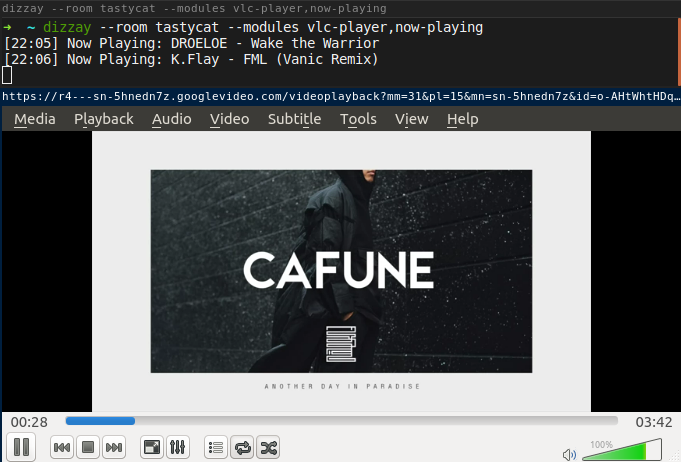

dizzay
======

`dizzay` (/ˈdɪːdʒeɪ/) is a command-line program that plays media from a plug.dj room in VLC or in Mplayer.

[Installation](#installation) -
[Usage](#usage) -
[Dependencies](#dependencies) -
[License](#license)



## Installation

```bash
npm install --global dizzay
```

And optionally, install the [terminal user interface](./dizzay-ui):

```bash
npm install --global dizzay-ui
```

## Usage

    dizzay [options]

    play music from a plug.dj room in VLC

    Options:

      -h, --help                 output usage information
      -u, --user [email]         email address of your plug.dj account. (optional, for login)
      -p, --password [password]  password of your plug.dj account. (optional, for login)
      -r, --room <room>          room url or slug to join.
      -q, --quality [quality]    video quality for YouTube videos. (low|medium|high) [medium]
      -a, --audio-only           do not show videos.
      --vlc                      play songs in vlc.
      --mplayer                  play songs in mplayer.
      --ui                       play songs and videos in a terminal ui. (requires `dizzay-ui` addon)
      --now-playing              log the current playing song to standard output.
      --mplayer-args <args>      string of space-separated command-line arguments to pass to mplayer.
      --vlc-args <args>          string of space-separated command-line arguments to pass to vlc.

The `--vlc`, `--mplayer` and `--ui` flags determine which media player to use.
If none of those flags are given, VLC is used.

Examples:

 * `dizzay --mplayer --now-playing tastycat`
 * `dizzay --vlc mrsuicidesheep-chillout`
 * `dizzay --now-playing --vlc loves-kpop`
 * `dizzay --ui hummingbird-me`

## Dependencies

You need a supported media player in your `$PATH` to run Dizzay.
On Linuxes, they can be installed through a command prompt using something like:

```bash
# apt-get on Debians/Ubuntus,
# but it should be similar for other distributions
apt-get install vlc     # for vlc
apt-get install mplayer # for mplayer
```

## Building

The source code is written in ES6 and can be compiled using:

```bash
npm run build
```

## License

MIT
